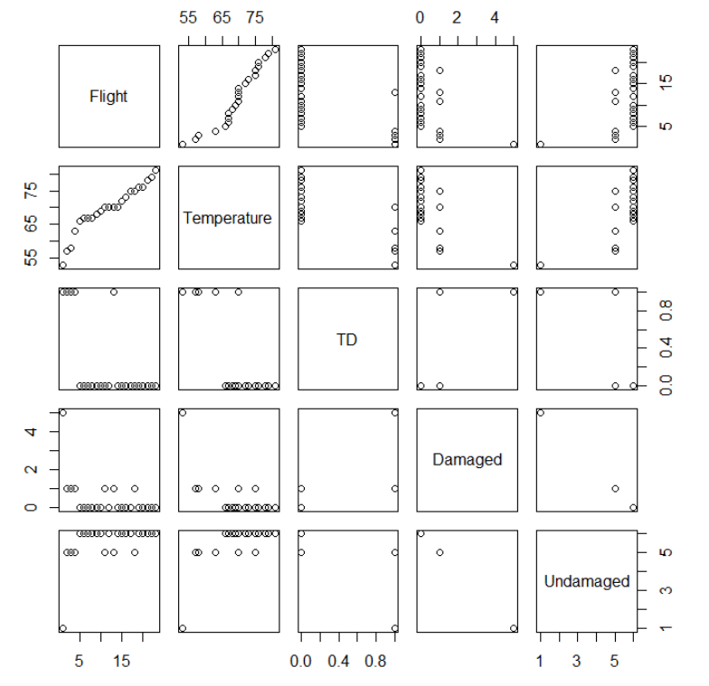
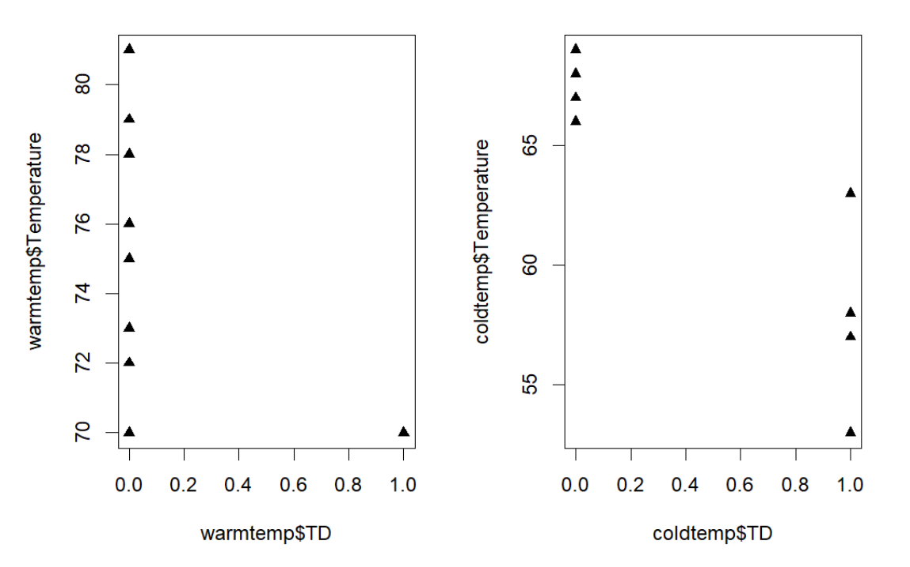
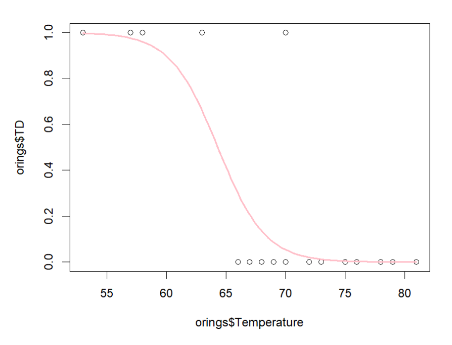
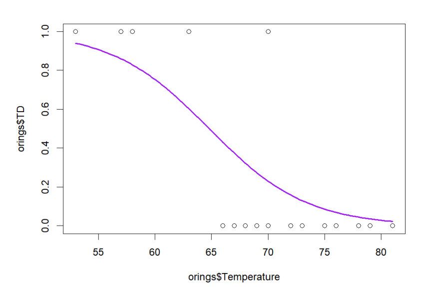

# Challenger-O-Ring-Failure-Probability-Modeling
This project analyzes historical NASA Space Shuttle O-ring data to investigate the relationship between launch temperature and O-ring failure risk. Logistic regression models were developed to quantify the probability of thermal distress and O-ring failure under varying environmental conditions.

## Can launch temperature be used to predict the likelihood of O-ring damage and thermal distress? 
Relevant data from 23 shuttle launches was utilized in order to examine the effect of temperature on thermal distress, and subsequently, the effect of
temperature on O-ring failure.
| Variable         | Description                  |
| ---------------- | ---------------------------- |
| Ft      | Flight number    |
| Temperature | Temperature at time of flight |
| TD   | Thermal distress on Oring (1 = yes, 0 = no)    |
| Damaged | Number of O-ring damaged after shuttle launch |
| Undamaged | Number of O-rings undamaged after shuttle launch |

The dataset was reviewed for completeness and consistency prior to analysis. Variables were inspected for missing values and encoded appropriately for binary logistic regression modeling. Temperature was treated as a continuous predictor variable, while thermal distress and O-ring failure were modeled as binary response variables. Initial visualizations were created to examine the distribution of launch temperatures and identify potential relationships between temperature and O-ring performance. Scatter plots and summary statistics suggested an increase in failure-related outcomes at lower temperatures.

To further examine the effect of temperature on thermal distress, temperature was divided into two groups of “warm” (≥ 70F) and “cold” (<70F). Scatter plots were created to observe the spread of the data for each partition.

With the exception of one data point at 70F, all noted points of no thermal distress lie above the temperature of 65F. At temperatures below that value, thermal distress was recorded true. 

## Statistical Methodology
Logistic regression was selected because the response variables (thermal distress and O-ring failure) were binary outcomes. Two separate models were developed to estimate the relationship between launch temperature and the probability of each event occurring. Model coefficients were interpreted in terms of changes in predicted risk under varying temperature conditions.

Two logistic regression models were constructed:

Model 1: Temperature predicting thermal distress
Model 2: Temperature predicting O-ring failure
Estimated probabilities were calculated across the observed temperature range to evaluate how launch conditions influenced failure risk.

### Thermal Distress by Temperature

### O-ring Failure by Temperature

Predictor significance was evaluated using both Wald tests and likelihood ratio tests. The differing conclusions produced by the two methods highlighted limitations of relying solely on coefficient-based significance testing and demonstrated the importance of comparing multiple inferential approaches. Analysis indicated that lower launch temperatures were associated with substantially greater probabilities of thermal distress and O-ring failure. Estimated probabilities changed considerably across the observed temperature range, suggesting temperature was an important operational risk factor.
